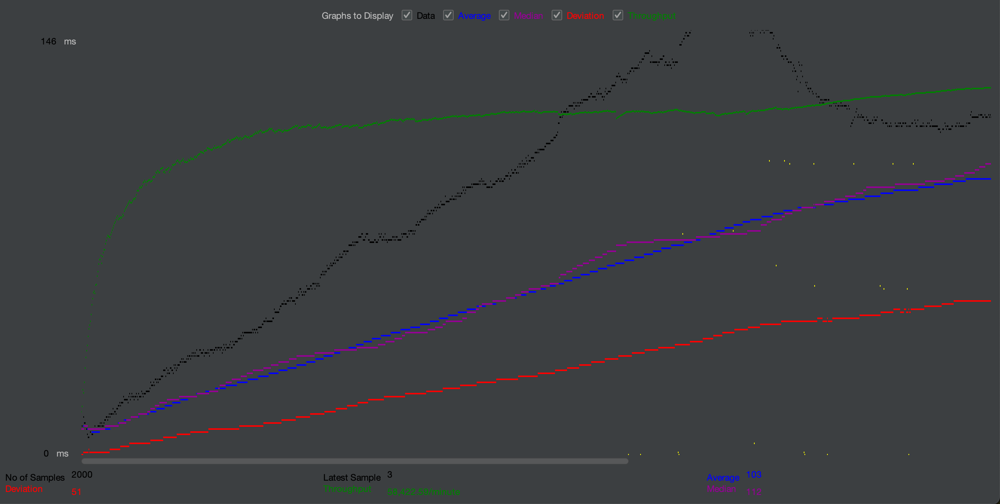
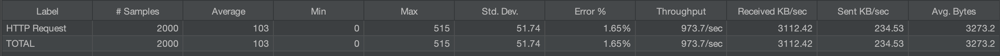
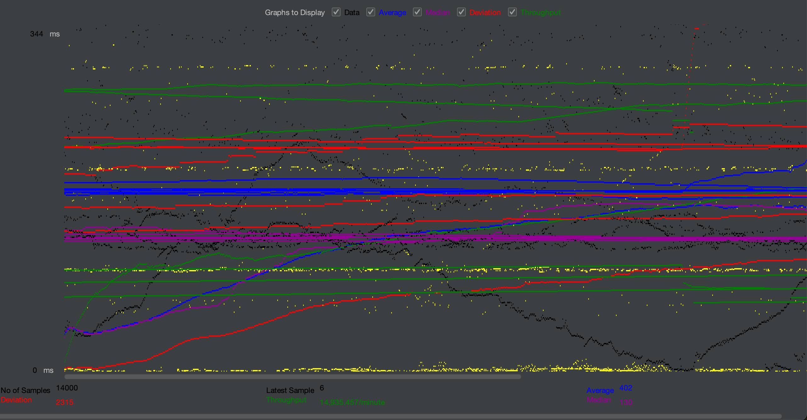
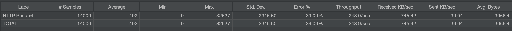

# Jmeter performance test for Kondensator app

### Application performance in different test cases

#### Case 1:
200 users every second, 10 times:

Graph:

Summary:

App would still function when hit by 200 every second 10 times,
the average response time would be 103ms and success rate would be 98.35%,
which is fine for small non commercial project like that.

#### Case 2:

350 users every second, 20 times:

Graph:

Summary:

App would still function when hit by 300 every second 20 times,
but now the average response time would be 402ms and success rate would be only 60.91%,
which is definitely not a good sign.

### Summary
Jmeter is a powerful tool for checking how your application handle user traffic.
To perform valid useful tests, you should approximate how much traffic are you expecting.
In my case tests were performed while hosting the app at localhost, in development environment.
In production environment you could make use of something like load balancing, thus making the results better.